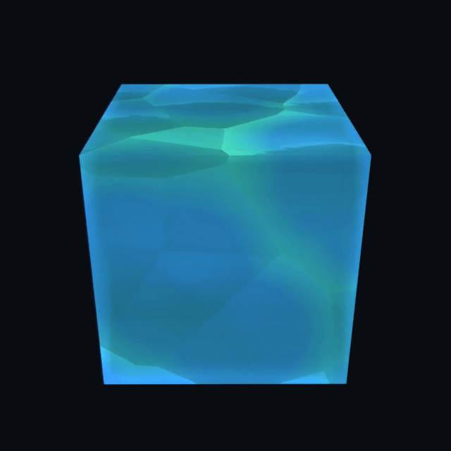
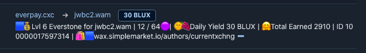
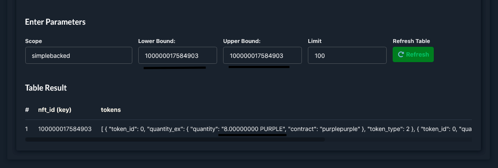

# Everstone NFTs

<p align="center">
  
</p>


Everstones are 🟣 [PURPLE](https://wax.bloks.io/tokens/PURPLE-wax-purplepurple)-backed NFTs that send out 🔵 [BLUX](https://wax.bloks.io/tokens/BLUX-wax-bluxbluxblux) or Blu Ups daily. One Everstone is backed by between 1-64 PURPLE, and has a daily auto-harvest of between 1-432 BLUX or Blu Ups. *When an Everstone is destroyed, the PURPLE is sent back to the Everstone's owner.*

> [👁️  See an Everstone in the wild](https://wax.simplemarket.io/products/asset/100000016933308)


# Now, you can finally [Buy an Everstone 🟦 💸](https://wax.simplemarket.io/products?authors=currentxchng)
> Also available on [NFThive](https://nfthive.io/market?collection=currentxchng&name=Everstone)

When you own an Everstone NFT, you get the choice to automatically Blu Up chosen content every day or receive a set reward in BLUX everyday. *Switching reward type may pause payment by 1 day.* 

> Currently, only direct BLUX payments are available. 

The more PURPLE an Everstone holds, the more efficient it becomes. 

# Everstone Harvest Levels + Rewards

| 🟣 PURPLE staked  | Daily Reward in Blu Ups or BLUX | Everstone Efficiency |
| :----:  | :-------------------: | :---------------: |
| 1         | 1                   | 100%            | 
| 2         | 3                   | 150%            | 
| 3         | 5                   | 167%            | 
| 4         | 7                   | 175%            | 
| 8         | 16                  | 200%            | 
| 12        | 30                  | 250%            | 
| 16        | 48                  | 300%            | 
| 32        | 144                 | 450%            | 
| 64        | 432                 | 675%         🧠 | 


## Everstone Release 
Everstone supply is limited via a trickling supply to avoid any one person/group controlling cXc.world's [Top Charts](Top-Charts.md). We will release already-staked Everstones for auction on [Simple Market](https://wax.simplemarket.io/explorer/main?skip=0&limit=20&searchString=everstone&locale=en) at regular intervals, as well as for direct sale on Simple Market and [Alcor](https://wax.alcor.exchange/nft-market). PURPLE-backed Everstones are sold for face value at the current cXc sell price of PURPLE (Currently 20 WAX/PURPLE). 

> We no longer plan to distribute non-backed Everstones, as this is harder for us to sort through. 

## Everstone Deals 
 
When buying an Everstone, consider if it's cheaper to buy a Level 1 Everstone and upgrade it or to purchase a higher-level stone with the PURPLE already staked. If the current PURPLE price is above 20 WAX, it's cheaper to buy a higher-level, already-staked Everstone. Otherwise, it's cheaper to buy the PURPLE from Alcor and then stake it manually to the Everstone.     

## Empowering Creators 👨‍🎤🎤
Everstones are particularly useful for creators, as daily Ups on their content gives them exposure on the mapp and [Top Charts](Top-Charts.md).

## Empowering Fans 🧝‍
Fans may collect BLUX to Blu Up their favorite artist's latest release. This can really help new artists, because local chart topping gives way to bigger charts, earning more BLUX from Sol Ups, new opportunities, and measurable exposure. 


# How it Works

Everstones are a [Simple Assets](https://wax.bloks.io/account/simpleassets) NFT.

Everstones store info (mdata) on whether the owner wants BLUX or Blu Ups, and if Blu Ups is chosen, the owner can also specify which content to send the daily Blu Ups. 

Once a day, we check how much PURPLE is staked on each Everstone, and if it's over 1, we distribute the owed Blu Ups or BLUX. There are no fractional Ups or BLUX, so rounding down to each level is used to calculate the rewards. For example, if you had 64 or 67 PURPLE staked to one Everstone, both would give 432 Blu Ups per day. 

*Open Possibility: If you choose BLUX payments, weekly or monthly recharge of [Solar Disk](Sol.md) may be required to receive the full amount. This is TBD as we consider what's best for all stakeholders. Currently there is no restriction.*  


# Daily Rewards

You'll get sent BLUX daily! No claims. When you reveive your BLUX, check the Memo to learn how much BLUX is staked. 

<p align="center">
  
</p>

> What if I don't get paid one day?

Thngs happen, and payments are occasionally missed, but your Everstone is prepared. Everstones store the last time you got paid in the metadata. If you miss a payment, even two, we'll automatically pay you all the BLUX you're owed in the next payment. If you got a new Everstone that's not paying you, or have another issue, please message [godsolislove](https://t.me/godsolislove).


## Staking PURPLE to an Everstone 
Staking additional PURPLE to an Everstone is done via a `transfer` of PURPLE to [simplebacked](https://wax.bloks.io/account/simplebacked) with a memo of the Everstone's Simple Assets NFT ID (ex 100000005145313). Eventually, we'll let you do stake more PURPLE right from [cXc.world](https://music.cxc.world).

Only the current owner of the Everstone can stake more PURPLE to it, so you don't need to worry about typing the wrong ID, as the `simplebacked` contract will return any PURPLE sent without an ID of an Everstone you currently own. 

> Important!! Double check before you don't stake more than 64 PURPLE to an Everstone, as any more than 64 PURPLE won't add additional benefits, and will be locked on `simplebacked` until the Everstone is liquidated (burnt)

## Verify your PURPLE has been Staked

Visit the [`simplebacked` contract's table](https://wax.bloks.io/account/simplebacked?loadContract=true&tab=Tables&account=simplebacked&scope=simplebacked&limit=100). Ensure scope says "simplebacked". Under BOTH the `Lower Bound:` and `Upper Bound:` fields, paste your Everstone's asset id (eg. `100000017584903`)

<p align="center">
  
</p>


## Wait for Everstone to Automagically Evolve

Your Everstone NFT's metadata (and title) will update right before the next payment, and that payment will reflect your new level. 

## Unstaking PURPLE from Everstones
Everstones will automatically return all tokens staked when the NFT is burned. If an Everstone is transferred and then burned, the owner at the time of burning will receive all tokens staked to the Everstone. Partial unstake isn't possible. *You must shatter the stone.* 


# Tech + Contracts 🔌

Everstones are Simple Assets NFT backed in Purple on a [simpleassets](https://wax.bloks.io/account/simpleassets) NFT using the [simplebacked](https://wax.bloks.io/account/simplebacked) contract to ensure all Everstones return their PURPLE to the rightful owner upon burning. ([example tx](https://wax.bloks.io/transaction/7a390ecf24f97e57482db730c2cfdc001d8bcda6a98d45fb7427d2afdcfdc052?tab=traces))  


Everstones store several pieces of data we use to ensure you get paid fairly. All Everstone data is `mdata` or mutable data, so it can be updated by our `currentxchng` account.  
 
Here's all the mdata on an Everstone.  

```javascript
{
  "name":"Everstone",
  "img":"QmbYghSQZRU8vTxU9nCsiJQ8hgV2g8PkvvNhY32idz42kn",
  "level":"6",
  "staked_purple":"12",
  "daily_blux":"30",
  "lifetime_blux":"360",
  "last":"09-07-2021",
  "todays_blux":"30"
}
```

> [See it on an Everstone](https://wax.simplemarket.io/products/asset/100000016933308)

Each time an Everstone is paid, the `mdata` is updated to reflect the payment in the `lifetime_blux`, `todays_blux`, and `last` field. The `last` field holds the date of the last payment, and in the event you don't receive a payment for any reason, *you'll be paid all you are owed in the next payment.*  

# [Buy an Everstone 🟦 💸](https://wax.simplemarket.io/authors/currentxchng)

> Also available on [Simple Market](https://wax.simplemarket.io/products?authors=currentxchng)

> Please note: *Everstones will emit Blu Ups* not considered in the Top 64 PURPLE rewards system, but displayed in the default Top Charts. Blu Ups help content get exposure, which may lead to organic Sol Ups + PURPLE rewards.
