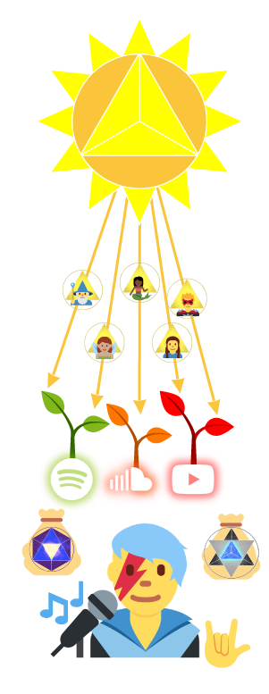

  

# 👨‍🎤 Purple Empowers Creators 

> 🧭 You've arrived to the first stop on your tour with cXc. This is your opener to cXc.world's economy, called Purple, made of the tokens [PURPLE](https://wax.bloks.io/account/purplepurple), [BLUX](https://wax.bloks.io/account/bluxbluxblux), and [SOL](Soldisk.md) (above), staking PURPLE with [Everstones](Everstones.md), [roadmap](Roadmap.md) and legal disclaimers. You can also browse our [tokenomic contracts](https://github.com/dougbutner/beta-pseudo).

🟣Purple is a three-token **Biomimetic Economy** where participants receive daily **SOL** to shine their light on content they love with a "Sol Up" (costs 1 SOL) that pays the content's creator a **BLUX**, which can Blu Up (costs 1 BLUX). Whoever gets the most Ups each day earns the real prize, **PURPLE**.

🗺[cXc.world](https://cxc.world) is a music map-dapp that runs on Purple (PURPLE, BLUX, SOL). 

***So what is Purple all about?***

# 🌞 Solar Concept

Purple is modeled after the Solar System.

> The Sun gives us lovelight each day. If we share that lovelight with others, we grow together. If we don’t, the lovelight is unmanifested and fades away. Either way, the Sun still shines the next day, giving us another chance to share and manifest this creative solar energy. 

  

You can claim up to 288 [SOL](Sol.md) tokens every day once you hold a [Soldisk NFT](Soldisk.md), which enable you to “Up” creations you love on [cXc.world](https://cxc.world/), a map of music (and soon more). You can Up content **multiple times**, anytime, spending 1 SOL or BLUX per Up.  

Your **Sol Up** is burned and the creator is rewarded 1 [BLUX](Blu.md). 1 BLUX can be spent for 1 **Blu Up**, in which case the BLUX is recycled to pay creators.  

Ups (Sol Ups + Blu Ups) make content grow bigger on the map, and are counted to rank music on the [Top Charts](Top-Charts).  

Music that makes it into the **Top 64** on the daily [Top Charts](Top-Charts.md) will earn additional rewards in [PURPLE](Purple.md). 288 PURPLE is sent out every day as creator's rewards.

In addition to [swaping for WAX](https://wax.alcor.exchange/swap?output=WAX-eosio.token&input=PURPLE-purplepurple), PURPLE is the fuel for [Everstone NFTs](Everstones.md), which automatically [send 1 Blu Up or 1 BLUX every day]() to the holder, and can be upgraded with more PURPLE for higher efficiency + rewards.  

## Purple Overview
Purple works with two `eosio.token`s on [WAX](https://on.wax.io/wax-io/): **[PURPLE](https://wax.bloks.io/account/purplepurple)**, **[BLUX](https://wax.bloks.io/account/bluxbluxblux)**, and a [Simple Assets](https://github.com/CryptoLions/SimpleAssets) fungible token, **[SOL](https://wax.simplemarket.io/trading/ft/currentxchng/SOL)**.

> We originally planned BLU to be BLUX for verified accounts. This two-tier model has been replaced with just BLUX, and blux has been empowered in PURPLE rewards

Free daily **SOL** facilitates collaboration via Sol Ups, which pay creators 1:1 in **BLUX**. Anyone can use **BLUX** (Abundant) to Blu Up, or trade it for **PURPLE** (scarce) or WAX. **PURPLE** can be staked for ultra-rare **[Everstone NFTs](Everstones.md)**, which help creations to **shine forever** with daily Ups.

All Ups (Blu Ups, Sol Ups + Blu Ups from Everstones) are combined and counted to determine Top Charts.

> Read about Everstone NFTs in [Everstones.md](Everstones.md)  
> Read about Soldisks in [Soldisk.md](Soldisk.md)  

Mapps (map-dapps) are **geotemporal**, and every mapp paint shows only a timespan's Upped content in a defined location. *With no Ups, it won't show up.* The latest displays only count Ups in the past day, making **[Everstones](Everstones.md)** an easy way not to disappear\*, and **Blu Ups** a shot to be seen at the top of local charts.

\* - You may also Up content manually with your daily Sol Ups

### How does a Geotemporal mapp work?
You can look at the latest trends (Monthly, Weekly, Daily, etc) or look into the past.* *Default is all-time.*

You can see trends for any nation. *Default is Global.*

\* - Past searches work from Summer Solstice, June 2019 onward. For songs posted before Beta, all Ups are assigned to the post date of the music. In Beta, the Time Machine will function with the time of the Up, and show trends down to 5-minutes, the length of one time unit. 

# Learn Everything About Purple

Project
- [Roadmap](Roadmap.md)
- [Tokenomic Brief](Economic-Brief.md)
- [Top Charts](Top-Charts.md)

Tokens
- [PURPLE](Purple.md)
- [BLU + BLUX](Blu.md)
- [SOL](Sol.md)
- [Everstones](Everstones.md) - Buy an Everstone [here](https://nfthive.io/market?collection=currentxchng)

Financial Info
- [Exchange Listing](Exchange-Listing.md)

Legal
- [Disclaimer](Legal/Disclaimer.md)
- [Legal Agreement](Legal/Legal-Agreement.md)

# Purple in the Wild
Try the first **cXc.world** Mapp using Purple, **cXc Music:** [music.cXc.world](https://music.cxc.world)

# cXc History
cXc.world (Alpha) launched in Dec 2018, integrated with Steemit (later Hive) with a music-to-blockchain one-click posting feature. Alpha had time-limited Ups, but not on-chain. After two minor releases (Silver Edition [2019] + Gold Version [2020]), the upcoming Beta release will enable the Purple Economy on WAX on cXc.world. [Roadmap 🛣️ ](https://github.com/currentxchange/purple-explainer/blob/master/Roadmap.md)

> All pre-beta Ups will be transitioned, so artists will get paid in BLUX for Ups happening now in Gold Version. 

> Note: We have temporarily removed Hive integration from cXc.world until WAX transition is complete to avoid confusion.  

🧠🗺️ Discover how Mapps work and what Mapps we've got planned in our [Mapps](https://docs.google.com/document/d/1YppJ2EYumRI2j0UHYdZh7NJMObMI_NfHgaFRLbjgBtw/preview) paper.  

# Quick Definitions

**cXc.world** - Home of Mapps like [cXc Music](https://music.cxc.world) with Top 64 music charts and NFT-enabled music map, curated democratically through Purple's double-fractal system of Geography and Time.  

**Mapp** - or "Map dapp" used to refer to the [mapps](https://docs.google.com/document/d/1YppJ2EYumRI2j0UHYdZh7NJMObMI_NfHgaFRLbjgBtw/preview) created by cXc using Purple

**Purple** - Biomimetic Economy developed by cXc.

**Up** - One unit of positive vibes, like a 'like', sent by clicking a yellow or blue triangle. Manifests as a `transfer` action. Sol Ups pay the creator in BLUX, while Blu Ups cost 1 BLUX.

**Top Charts** - Content sorted by Up count, used to distribute rewards in PURPLE and determine which content should appear most prominently on the map. Top 64 global content is rewarded 288 PURPLE daily. Daily, weekly, monthly and yearly global charts will be [published on Hive](https://peakd.com/cxc-music/@currentxchange/cxc-music-top-hip-hop-charts-week-20-2020-dapp-music-cxc-world).

**Geotemporal** - Geographic + Temporal. Every Up happens at a time (temporal, token transfer Tx) and location (of the song). Systemically manifesting as iterated, self-similar levels corresponding to Top Charts, geography as *city, county, state, nation, globe* and time building from a *Time Unit*, with Gregorian-calander charts for *days, weeks, months, and years*. This fractal system's base iteration being city charts at one time unit, and all city charts making the county charts, all counties the state charts, etc. Every geotemporal display can be filtered by genre, format, and mood to reveal detailed charts and painted music maps on [cXc.world](https://cxc.world). 

**Time Unit** - 5-minute units (288 per day) used to run cXc.world's geotemporal charts, and as the basis of Purple. 1 SOL = 1 time unit per Soldisk-holding account, as this is the allowance of SOL cXc gives. Top Charts are calculated every time unit, with a 1 PURPLE reward (288/day), so 1 PURPLE = 1 time unit. Gregorian calendar charts (Month, Week, etc.) are available, as well as down to the 5- minute time unit.

**SOL** - Abundant Time Token that can be received freely up to 288 SOL per day by any user of [mapps](https://docs.google.com/document/d/1YppJ2EYumRI2j0UHYdZh7NJMObMI_NfHgaFRLbjgBtw/preview) holding a Soldisk. Spent 1:1 to give Sol Ups. Controlled by cXc.

**BLUX** - Abundant token distributed to recipients of Sol Ups, and for completion of Role-based tasks. Spent 1:1 to give Blu Ups, recycled to creators

**PURPLE** - Scarce token that can be staked to activate [Everstone NFTs](Everstones.md) for daily rewards, or to [Soldisks](Soldisk.md)

**Everstone** - PURPLE-backed NFT that Blu Ups a specific piece of content on a mapp daily automatically [Read about Everstones](Everstones.md) or offers daily BLUX ([direct to wallet](https://wax.bloks.io/account/everpay.cxc)) of the same value. [Buy Everstones](https://nfthive.io/market?collection=currentxchng)

**Soldisk** - NFT held to register a user as a valid claimer of SOL. [Learn about Soldisks](Soldisk.md)

**cXc** - Short for Current X Change LLC, Maryland, USA. X is usually pronounced as letter. Our name has many meanings, including "Current Times Change" or meaning exchanging energy (current), or exchanging now (current), "Current eXChange". In Maths, the change of x (a variable) is represented by Δ (Delta), the same triangular symbol of Ups, with SOL's logo being a [Tetrahedron](https://en.wikipedia.org/wiki/Platonic_solid) (four triangles, X), and two tetrahedrons combining to form a Merkaba, BLUX's symbol, and connecting all vertices of the Merkaba to reveal the Cube, the next platonic solid. Purple is the final platonic solid, representing crystallization of the highest now-energy.

# Features

## Eco-Friendly

Purple lives on [**WAX**](https://on.wax.io/co2/), an [EOSIO](https://eos.io/about/) blockchain.

“EOSIO is 66,000 times more energy efficient than Bitcoin and 17,000 times more energy efficient than Ethereum” [GenerEOS](https://www.genereos.io/eosenergyconsumption/), 2018.

 *Nobody mines WAX!*

## No Keys to lose, No Wallet to Download
You can use [WAX Cloud Wallet](https://all-access.wax.io/) to sign up for a free custodial wallet with just your email or social login. You'll always login to your wallet with this email/social, so you don't have to worry about losing (or even storing) your private keys. Purple on cXc.world works seamlessly with WAX Cloud Wallet, and you can even pre-approve things like Ups and receiving your payments so you don't have to manually sign every transaction.

> With WAX Cloud Wallet, anyone can use blockchain and participate in the Purple economy.

If you prefer to be responsible for your private keys, any EOSIO wallet can hold your PURPLE, BLU and SOL.

# Buy PURPLE
## Acquire PURPLE with WAX
WAX/PURPLE market is on [Alcor.exchange](https://wax.alcor.exchange/trade/PURPLE-purplepurple_WAX-eosio.token).

> Alcor has 0 transaction fees

1. Visit the desired exchange
2. Switch to "WAX" blockchain
3. Visit the PURPLE / WAXP trading pair
4. Place your order. Your PURPLE will show up automatically in your WAX wallet.

## Acquire PURPLE with FIAT (Credit / Debit), BTC, ETH

To acquire PURPLE without an existing WAX wallet, follow these steps:

1. Get a free WAX wallet [here](https://all-access.wax.io/)
2. Click "**Buy Wax**" in your [dashboard](https://all-access.wax.io/dashboard)
3. Choose Moonpay, ChangeNOW or Simplex to purchase the WAX directly
4. Trade the WAX for PURPLE on Alcor or Newdex (above)

# DeFi Liquidity Pools

Instant Liquidity via Alcor Swap: [WAX/PURPLE](https://wax.alcor.exchange/swap?output=PURPLE-purplepurple&input=WAX-eosio.token), [WAX/BLUX](https://wax.alcor.exchange/swap?output=BLUX-bluxbluxblux&input=WAX-eosio.token), and [BLUX/PURPLE](https://wax.alcor.exchange/swap?input=BLUX-bluxbluxblux&output=PURPLE-purplepurple).

# Requirements & Restrictions
Participating in the direct listing requires that you adhere and agree to the requirements, restrictions, terms and conditions laid out in [disclaimer.md](Legal/Disclaimer.md) and [legal-agreement.md](Legal/Legal-Agreement.md)

*As this is pre-beta, consider all elements subject to modifications except the total supply of tokens, founder pay, and liquidity promise*

- - - - - - - - - - - - - - - - - - - - - - - -
## 💥 WALK WITH [cXc](https://linktr.ee/cXc.world) 💥
- - - - - - - - - - - - - - - - - - - - - - - -

Current X Change is dedicated to harmonizing Humans, Collectives, and Gaia. Our media Mapps are just the start. As we refine Purple, we also seek to redefine what it means to come together as humans and co-create. We hope you'll enjoy the tools already here, and we're infinitely stoked for what our future holds. 

## 👨‍🎤 Experience [cXc.world 🌎](https://cXc.world)

## 🤝 Get to know [🟣 Purple](https://github.com/currentxchange/purple-explainer)

## 🎥  [Add Music to cXc.world](https://www.youtube.com/watch?v=7NCaG2ZPHOQ)

# [🖇🌳](https://linktr.ee/cXc.world)

- - - - - - - - - - - - - - - - - - - 
# 🎁 Music NFTs on WAX 🚀 
- - - - - - - - - - - - - - - - - - - 

### 🗺 [Music NFT Map](https://cxc.world/?format=nft)  
### 🛍  Curated (cXc) Collection [drops.cxc.world](https://drops.cxc.world)  
### 🛠  [Music NFT standard](https://github.com/currentxchange/Music-NFT-Standard)  

- - - - - - - - - - - - - - - - - - - - - - - - - - - - - - - - - - - - - - - -
# 💰 BARTER [🟣PURPLE](https://wax.alcor.exchange/swap/?input=WAX-eosio.token&output=PURPLE-purplepurple), [🔵BLUX](https://wax.alcor.exchange/swap?input=WAX-eosio.token&output=BLUX-bluxbluxblux) on Alcor DEX 📈🏊‍♂️
- - - - - - - - - - - - - - - - - - - - - - - - - - - - - - - - - - - - - - - - 

🧭 Explore these tokens in our [Purple Explainer](https://github.com/currentxchange/purple-explainer/) 📍 You Are Here

- - - - - - - - - - - - - - - - - - - 
# 👕 WEAR cXc [High-fashion](https://artofwhere.com/artists/cxc-world-merch) 🇨🇦 🛍️ [Redbubble](https://www.redbubble.com/people/currentxchange/shop?artistUserName=CurrentXChange&iaCode=all-stickers) 🔴
- - - - - - - - - - - - - - - - - - - 

## **[🎶 Jam with us in cXc's 🎮 Discord](https://discord.gg/u3kpj7xEWZ)** 

- We're also on [✈️ Telegram](https://t.me/cXc_world) 

- And welcome music posts in our [🏘️ Hive Community](https://peakd.com/c/hive-179421) 
 

- - - - - - - - - - - - - - - - - - - - - - - 

##### (cXc) [📺 YouTube](https://youtube.com/channel/UCBjTUosp2R_FN6AFdHV-v-Q) --- [🐝 Hive](https://peakd.com/@currentxchange) --- [🔺 Reddit](https://www.reddit.com/r/cXcMusic)  --- [🖼️ Instagram](https://instagram.com/cxc.world) --- [🐦 Twitter](https://twitter.com/currentxchange)

- - - - - - - - - - - - - - - - - - - - - - -

##  [🛣️ Roadmap](https://github.com/currentxchange/purple-explainer/blob/master/Roadmap.md) [ 👁 OG Vision](https://currentxchange.com/vision) [🟣 OG Paper](https://docs.google.com/document/d/1T2JH9J73WjgZ9-cULJAzrYvZzyPSXEA_fdgt21lHnDc/preview)
