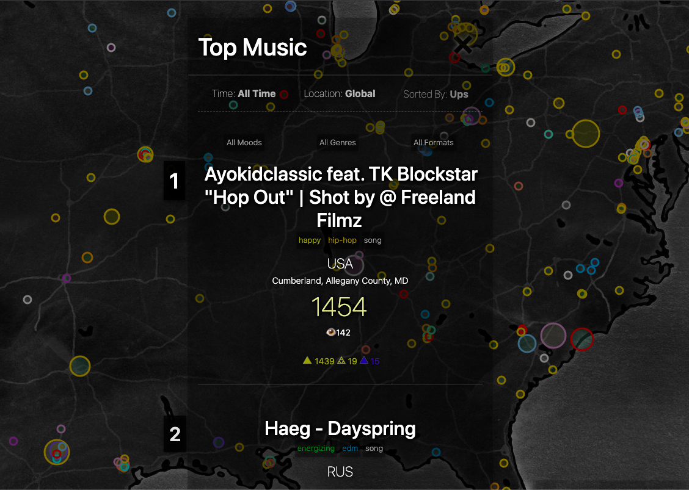
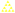

# Top 64 Charts

  

# 🟣 PURPLE Rewards Creators People Up 🔌

One 🟣 PURPLE is rewarded per time unit to Top 64 Charts in each cXc Music Dapp, starting with [cXc Music](https://music.cXc.world)

This 1 🟣 PURPLE / Time Unit reward will be given out daily as 288 PURPLE divided linearly among the top 64 tracks. When we release other cXc Mapps, this reward will be the same for each mapp. 

> 288 SOL per person, and 288 PURPLE for Top Charts for cXc.world dapps, every day. These are the gears of the Purple Economy. 

# Youtube Music + Purple Rewards
Artist rewards go to the owner of the Youtube channel which uploaded the song embedded in a cXc.world post. Through linking a WAX account to the channel that uploaded the video, we can pay the rightful account PURPLE, and even split payments up to 12 ways. If a Youtube video's owner is not on cXc.world, pending reward is reserved and will be claimable upon linking the Youtube account. 

# Top Charts 🌎 

> Top Charts show up tailored to every search you do on cXc.world. 

The Top Charts shown on cXc.world rank the top music by adding up `Blu Ups + Sol Ups` for any time period a viewer wishes.  

Default Ranking on cXc.world = `Total Blu Ups + Sol Ups` 

In addition to the default ranking, users on cXc.world can choose to see Top Charts by the following:

- Only   Sol Ups  

- Only   Blu Ups  

- Only   Big Ups  

`Total Blu Ups + Sol Ups` ranking is used when we send out emails and updates about current music trends. It's the default for everything *except* PURPLE rewards. 

# PURPLE Rewards + Top 64 Charts 🌎🟣

The Top 64 Charts used to reward creators in PURPLE use `Only Sol Ups` to determine who gets rewarded. 

> Update: We are considering allowing up to a 4:1 ratio of Blu Ups to Sol Ups to be considered in rewards algorithm.

> Linear rewards are used where #1 gets 64 times what #64 gets 1.

Using `Only Sol Ups` gives PURPLE rewards a more democratic nature, as no one can buy SOL (unlike BLUX). 

Also, because cXc executes the Sol Up actions on-chain (unlike BLUX) we can have a say in preventing fake accounts, etc from trying to game the system. 

> Note: This algorithm is subject to change. We plan to incorporate rewards for local charts as well as global charts after cXc.world is more popular. That's going to change things, but the linear rewards will always remain. 

# What if a charting creator doesn't have an account on cXc.world?
We'll keep a record on how much each account is owed using the Youtube video's account information. Later, when they create an account, they will be able to claim all the PURPLE owed to them automatically by connecting the youtube account to their WAX account, used as cXc.world login. 

# BLUX Beyond Charts 🧠🔮🧙‍♂️

🔵  BLUX gives you the same exposure for people looking at the map. With this boost in exposure, good music should attract more Sol Ups, which in turn earns more BLUX. So subjectively good music may have a good return of 🔵 BLUX, subjectively bad music = bad or no return.  

All the while, the Sol Ups that a creator attracted will have the potential to earn them 🟣 PURPLE if they make the Top 64 Global Charts (Daily)

> An artist could buy 🔵 BLUX, spend it to Blu Up their latest song, which could attract organic Sol Ups, giving them more BLUX. 🔵 BLUX can be sold or spent for more Blu Ups, so the artist can get back the money they spent, or more. If the Sol Ups were enough that they made the Top 64 Global Charts for the day, they'll earn 🟣 PURPLE too. 
